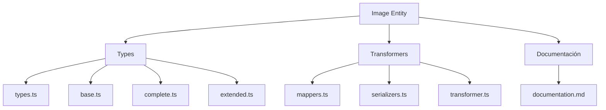
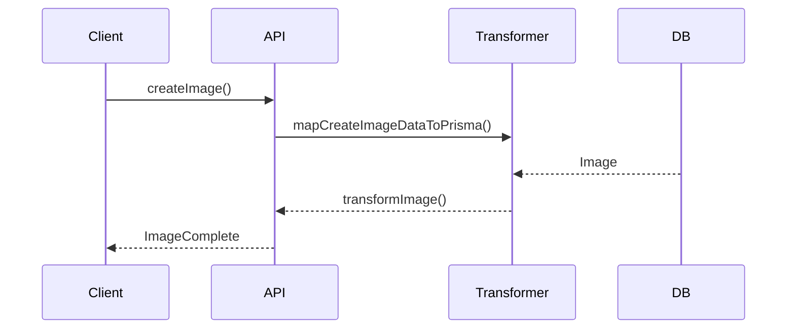

# 📷 Entidad Image

## Descripción

La entidad `Image` representa imágenes almacenadas en el sistema, incluyendo metadatos, relaciones y atributos multimedia. Permite asociar imágenes a álbumes, colecciones, personajes, lugares, notas, etc.

---

## Estructura



---

## Tipos principales

- `ImageBase`, `ImageComplete`, `ImageCreateInput`, `ImageUpdateInput`
- Filtros: `ImageFilters`, `ImageSearchOptions`, `ImageSearchResult`

---

## Ejemplo de uso

```typescript
import { createImage, updateImage, searchImages } from '@/transformers/image';

const nuevaImagen = await createImage({ name: 'Paisaje', url: '/uploads/paisaje.jpg' });
const imagenes = await searchImages({ filters: { search: 'Paisaje' } });
await updateImage(nuevaImagen.id, { description: 'Un paisaje hermoso.' });
```

---

## Flujo de datos



---

## Mejores prácticas

- Usar siempre los tipos canónicos (`ImageCreateInput`, `ImageUpdateInput`, `ImageComplete`).
- Validar los datos antes de crear/actualizar (`validateImage`).
- Usar los mapeadores para relaciones complejas.
- Mantener la documentación y diagramas actualizados.

---

## Integración

Las imágenes pueden asociarse a:

- Álbumes, colecciones, personajes, lugares, notas, conceptos, prompts, grupos, etc.

Al eliminar una imagen, revisar las relaciones para evitar referencias huérfanas.

---

> Última actualización: 2025-06-10
