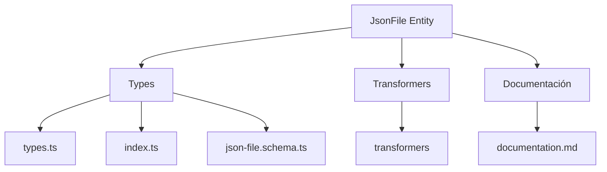
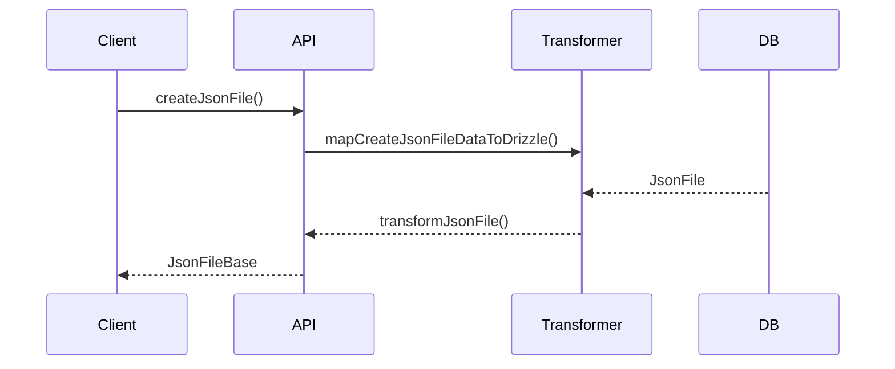

# 🟫 Entidad JsonFile

## Descripción

La entidad `JsonFile` representa archivos de datos estructurados en formato JSON que pueden ser almacenados y gestionados en el sistema. Estos archivos JSON pueden contener configuraciones, datos exportados, estructuras de datos, etc.

## Estructura



## Tipos principales

- `JsonFileBase`: Tipo base con campos fundamentales
- `JsonFileCreateInput`: Input para creación de archivos JSON
- `JsonFileUpdateInput`: Input para actualización de archivos JSON

## Ejemplo de uso

```typescript
import { createJsonFile, updateJsonFile, getJsonFile } from '@/transformers/json-file';

// Crear un nuevo archivo JSON
const nuevoArchivo = await createJsonFile({
  name: 'Configuración de usuario',
  filePath: '/configs/user-config.json',
  content: JSON.stringify({
    theme: 'dark',
    language: 'es',
    notifications: {
      email: true,
      push: false
    },
    preferences: {
      autoSave: true,
      compactView: false
    }
  }, null, 2)
});

// Obtener un archivo JSON existente
const archivo = await getJsonFile(nuevoArchivo.id);

// Actualizar un archivo JSON existente
await updateJsonFile(nuevoArchivo.id, {
  content: JSON.stringify({
    theme: 'light',
    language: 'es',
    notifications: {
      email: true,
      push: true
    },
    preferences: {
      autoSave: true,
      compactView: true
    }
  }, null, 2)
});
```

## Flujo de datos



## Mejores prácticas

- Usar siempre los tipos canónicos (`JsonFileCreateInput`, `JsonFileUpdateInput`, `JsonFileBase`).
- Validar los datos antes de crear/actualizar con el esquema Zod `jsonFileSchema`.
- El campo `content` debe contener JSON válido.
- Verificar que el JSON sea válido antes de guardarlo.
- Considerar utilizar `JSON.parse()` y `JSON.stringify()` para manejar el contenido JSON.

## Integración

Los archivos JSON pueden integrarse con:

- Configuraciones de usuario y sistema
- Exportación e importación de datos
- Almacenamiento de datos estructurados
- Intercambio de datos con APIs externas

## Migración a tipos canónicos

✅ Tipos canónicos implementados desde el inicio, documentación y diagrama actualizados.

---

> Última actualización: 2025-06-18