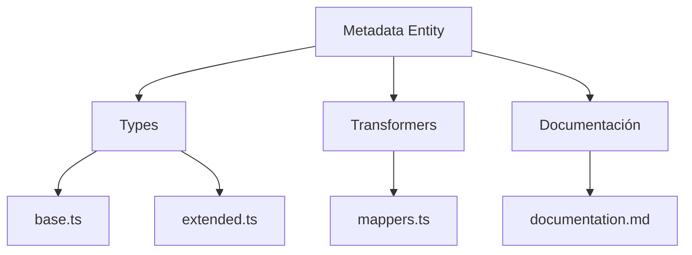
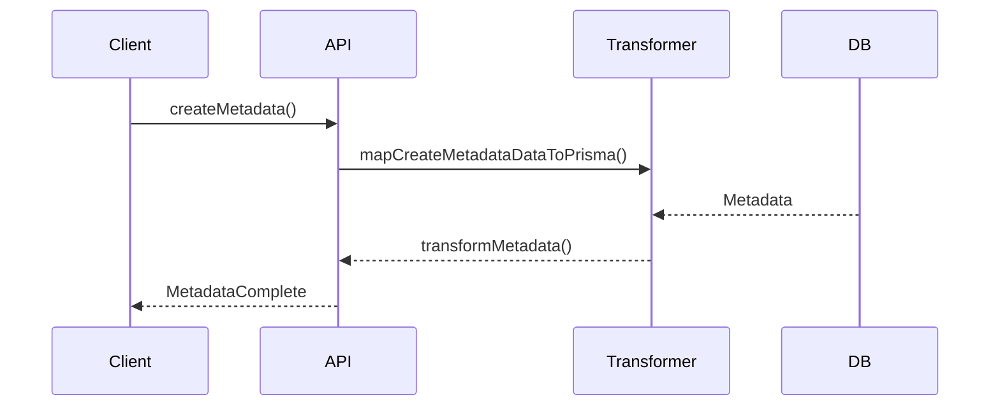

# 🏷️ Entidad Metadata

## Descripción

La entidad `Metadata` representa metadatos asociados a cualquier recurso del sistema (imágenes, álbumes, colecciones, etc.), permitiendo almacenar información adicional, etiquetas, propiedades dinámicas y datos enriquecidos.

---

## Estructura



---

## Tipos principales

- `MetadataBase`, `MetadataComplete`, `MetadataCreateInput`, `MetadataUpdateInput`
- Filtros: `MetadataFilters`, `MetadataSearchOptions`, `MetadataSearchResult`

---

## Ejemplo de uso

```typescript
import { createMetadata, updateMetadata, searchMetadata } from '@/transformers/metadata';

const nuevoMeta = await createMetadata({ key: 'exif:iso', value: 100 });
const metadatos = await searchMetadata({ filters: { key: 'exif:iso' } });
await updateMetadata(nuevoMeta.id, { value: 200 });
```

---

## Flujo de datos



---

## Mejores prácticas

- Usar siempre los tipos canónicos (`MetadataCreateInput`, `MetadataUpdateInput`, `MetadataComplete`).
- Validar los datos antes de crear/actualizar (`validateMetadata`).
- Usar los mapeadores para relaciones complejas.
- Mantener la documentación y diagramas actualizados.

---

## Integración

Los metadatos pueden asociarse a:

- Imágenes, álbumes, colecciones, personajes, lugares, notas, conceptos, prompts, grupos, etc.

Al eliminar un metadato, revisar las relaciones para evitar referencias huérfanas.

---

> Última actualización: 2025-06-10
