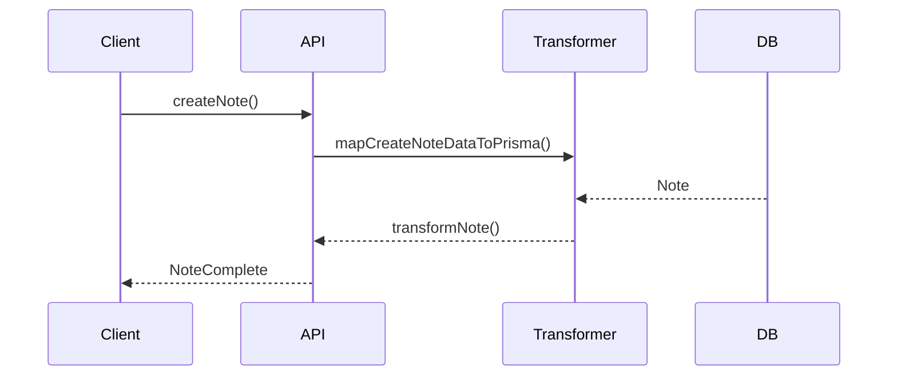

# Note entity

## Purpose

The `Note` entity represents Notes in Media Manager. Notes can associate with images, Characters, Concepts, and more. They support organization, documentation, and advanced reminders.

## Structure


## Main types

The module uses these types:

- `NoteBase`, `NoteComplete`, `NoteCreateInput`, `NoteUpdateInput`
- Filters: `NoteFilters`, `NoteSearchOptions`, `NoteSearchResult`

## Usage example

```typescript
import { createNote, updateNote, searchNotes } from '@/transformers/note';

const newNote = await createNote({ title: 'Idea', content: 'Text', category: 'general' });
const notes = await searchNotes({ filters: { searchQuery: 'Idea' } });
await updateNote(newNote.id, { content: 'Updated' });
```

## Data flow



## Practices

- Use the canonical types (`NoteCreateInput`, `NoteUpdateInput`, `NoteComplete`).
- Validate data before you create or update (`validateNote`).
- Use mappers for complex relations.
- Keep documentation and diagrams current.

## Warning

**Do not import legacy database types. Use only the types from `types.ts`.**
