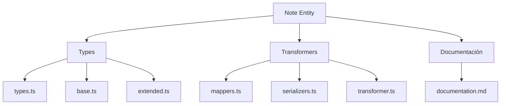
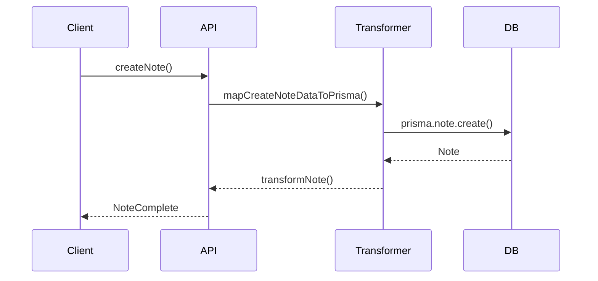

# 📝 Entidad Note

## Descripción

La entidad `Note` representa notas en el sistema, asociables a imágenes, personajes, conceptos y más. Permite organización, documentación y recordatorios avanzados.

## Estructura



## Tipos principales

- `NoteBase`, `NoteComplete`, `NoteCreateInput`, `NoteUpdateInput`
- Filtros: `NoteFilters`, `NoteSearchOptions`, `NoteSearchResult`

## Ejemplo de uso

```typescript
import { createNote, updateNote, searchNotes } from '@/transformers/note';

const nuevaNota = await createNote({ title: 'Idea', content: 'Texto', category: 'general' });
const notas = await searchNotes({ filters: { search: 'Idea' } });
await updateNote(nuevaNota.id, { content: 'Actualizado' });
```

## Flujo de datos



## Mejores prácticas

- Usar siempre los tipos canónicos (`NoteCreateInput`, `NoteUpdateInput`, `NoteComplete`).
- Validar los datos antes de crear/actualizar (`validateNote`).
- Usar los mapeadores para relaciones complejas.
- Mantener la documentación y diagramas actualizados.

## Integración

Las notas pueden asociarse a:

- Imágenes, videos, álbumes, colecciones
- Personajes, conceptos, prompts, propiedades, grupos, etc.

Al eliminar una nota, revisar las relaciones para evitar referencias huérfanas.

---

> Última actualización: 2025-06-10
