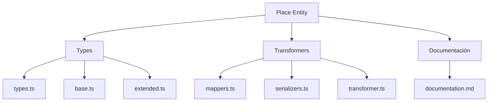
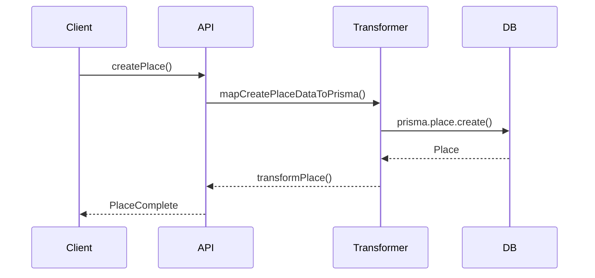

# 🗺️ Entidad Place

## Descripción

La entidad `Place` representa ubicaciones, escenarios o lugares relevantes en el sistema. Puede asociarse a imágenes, notas, personajes, colecciones y más, permitiendo modelar mapas, mundos, ubicaciones narrativas, etc.

## Estructura



## Tipos principales

- `PlaceBase`, `PlaceComplete`, `PlaceCreateInput`, `PlaceUpdateInput`
- Filtros: `PlaceFilters`, `PlaceSearchOptions`, `PlaceSearchResult`

## Ejemplo de uso

```typescript
import { createPlace, updatePlace, searchPlaces } from '@/transformers/place';

const nuevoLugar = await createPlace({ name: 'Bosque Encantado', type: 'bosque' });
const lugares = await searchPlaces({ filters: { search: 'Bosque' } });
await updatePlace(nuevoLugar.id, { description: 'Un bosque lleno de magia.' });
```

## Flujo de datos



## Mejores prácticas

- Usar siempre los tipos canónicos (`PlaceCreateInput`, `PlaceUpdateInput`, `PlaceComplete`).
- Validar los datos antes de crear/actualizar (`validatePlace`).
- Usar los mapeadores para relaciones complejas.
- Mantener la documentación y diagramas actualizados.

## Integración

Los lugares pueden asociarse a:

- Imágenes, notas, álbumes, personajes, conceptos, prompts, grupos, etc.

Al eliminar un lugar, revisar las relaciones para evitar referencias huérfanas.

---

> Última actualización: 2025-06-10
