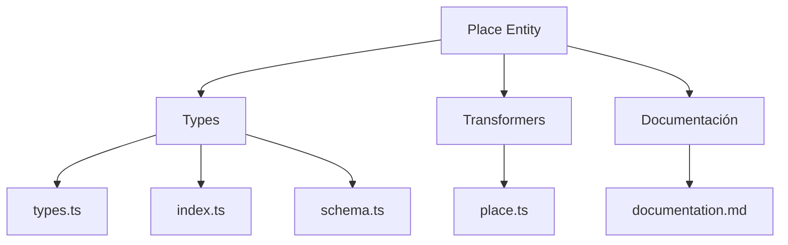
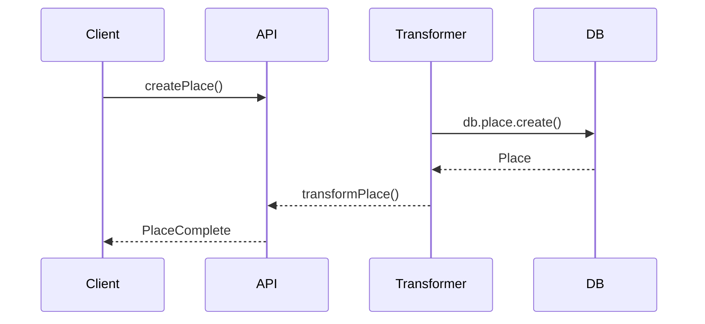

# 🗺️ Entidad Place

## Descripción

La entidad `Place` representa ubicaciones, escenarios o lugares relevantes en el sistema. Puede asociarse a imágenes, notas, personajes, colecciones y más, permitiendo modelar mapas, mundos, ubicaciones narrativas, etc.

## Estructura



## Tipos principales

- `PlaceBase`: Tipo base con campos fundamentales
- `PlaceComplete`: Tipo completo con relaciones, conteos y datos deserializados
- `PlaceCreateInput`, `PlaceUpdateInput`: Inputs para mutaciones
- Filtros: `PlaceFilters`, `PlaceSearchOptions`, `PlaceSearchResult`
- Enumeraciones: `PlaceCategory`, `PlaceType`, `PlaceClimate`, `PlaceSortCriteria`

## Ejemplo de uso

```typescript
import { createPlace, updatePlace, searchPlaces } from '@/transformers/place';

const nuevoLugar = await createPlace({
	name: 'Bosque Encantado',
	type: 'forest',
	description: 'Un bosque mágico lleno de criaturas míticas',
});

const lugares = await searchPlaces({
	where: { searchQuery: 'Bosque' },
});

await updatePlace(nuevoLugar.id, {
	resources: [{ name: 'Flores mágicas', description: 'Plantas con propiedades curativas' }],
});
```

## Flujo de datos



## Mejores prácticas

- Usar siempre los tipos canónicos (`PlaceCreateInput`, `PlaceUpdateInput`, `PlaceComplete`).
- Validar los datos antes de crear/actualizar con ZodSchema.
- Usar los transformadores para manejar relaciones complejas.
- Mantener la documentación y diagramas actualizados.

## Integración

Los lugares pueden asociarse a:

- Imágenes, videos
- Álbumes, colecciones
- Personajes, conceptos
- Notas, prompts
- Tags, propiedades
- Grupos, world-items

## Migración a tipos canónicos

✅ Tipos canónicos migrados, legacy eliminado, documentación y diagrama actualizados.

---

> Última actualización: 2025-06-10
