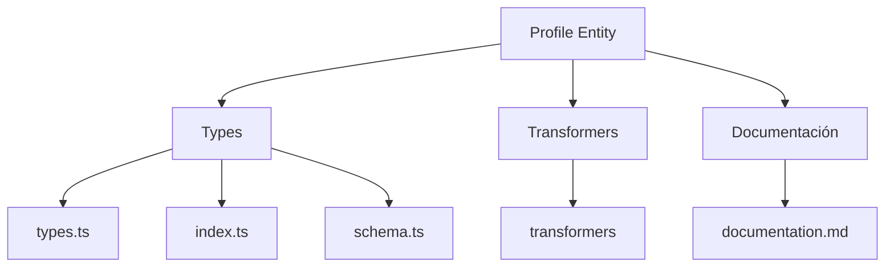
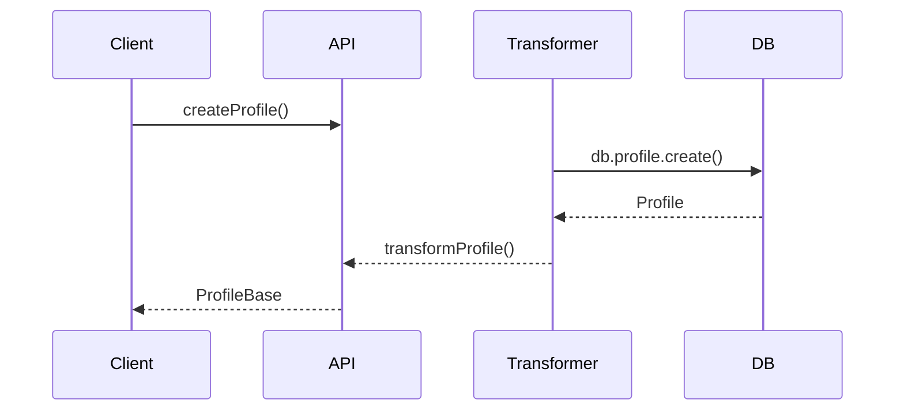

# 👤 Entidad Profile

## Descripción

La entidad `Profile` representa la información de perfil de usuario, incluyendo datos personales, preferencias, configuraciones y relaciones con otros recursos del sistema.

## Estructura



## Tipos principales

- `ProfileBase`: Tipo base con campos fundamentales
- `ProfileCreateInput`: Input para creación de perfiles
- `ProfileUpdateInput`: Input para actualización de perfiles
- `ThemeMode`: Enum para el tema de la interfaz (system, light, dark)
- `Language`: Enum para el idioma (es, en, pt, fr)

## Ejemplo de uso

```typescript
import { createProfile, updateProfile, getProfile } from '@/transformers/profile';

// Crear un nuevo perfil
const nuevoPerfil = await createProfile({
	name: 'Usuario Principal',
	emoji: '👨‍💻',
	color: '#3b82f6',
	theme: 'dark',
	language: 'es',
	description: 'Perfil principal del sistema',
});

// Obtener un perfil existente
const perfil = await getProfile(nuevoPerfil.id);

// Actualizar un perfil existente
await updateProfile(nuevoPerfil.id, {
	name: 'Usuario Actualizado',
	theme: 'light',
	description: 'Perfil actualizado con nueva configuración',
});
```

## Flujo de datos



## Mejores prácticas

- Usar siempre los tipos canónicos (`ProfileBase`, `ProfileCreateInput`, `ProfileUpdateInput`).
- Validar los datos antes de crear/actualizar con `ProfileSchema` o los esquemas específicos.
- Utilizar los enums `ThemeMode` y `Language` para garantizar valores válidos.
- Para preferencias avanzadas, usar `profilePreferencesSchema`.
- Implementar validaciones específicas con los esquemas Zod.

## Integración

Los perfiles pueden integrarse con:

- Configuraciones personalizadas del sistema
- Preferencias de visualización y experiencia de usuario
- Asociaciones con imágenes de avatar
- Relaciones con otras entidades como álbumes, colecciones, notas, etc.

## Migración a tipos canónicos

✅ Tipos canónicos migrados, documentación y diagrama actualizados.

---

> Última actualización: 2025-06-18
