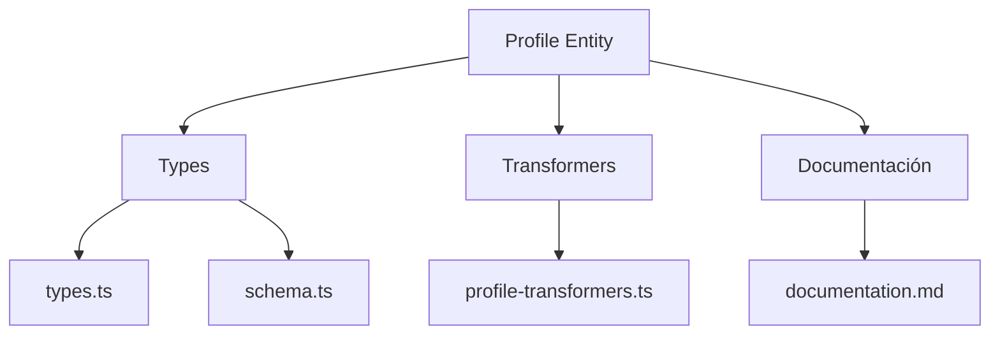
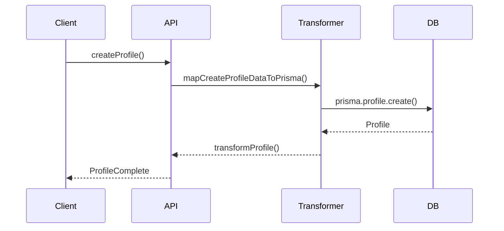

# 👤 Entidad Profile

## Descripción

La entidad `Profile` representa la información de perfil de usuario, incluyendo datos personales, preferencias, configuraciones y relaciones con otros recursos del sistema.

---

## Estructura



---

## Tipos principales

- `ProfileBase`, `ProfileComplete`, `ProfileCreateInput`, `ProfileUpdateInput`
- Filtros: `ProfileFilters`, `ProfileSearchOptions`, `ProfileSearchResult`

---

## Ejemplo de uso

```typescript
import { createProfile, updateProfile, searchProfiles } from '@/transformers/profile/profile-transformers';

const nuevoPerfil = await createProfile({ username: 'usuario1', email: 'user@email.com' });
const perfiles = await searchProfiles({ filters: { username: 'usuario1' } });
await updateProfile(nuevoPerfil.id, { bio: 'Nuevo bio' });
```

---

## Flujo de datos



---

## Mejores prácticas

- Usar siempre los tipos canónicos (`ProfileCreateInput`, `ProfileUpdateInput`, `ProfileComplete`).
- Validar los datos antes de crear/actualizar (`validateProfile`).
- Usar los mapeadores para relaciones complejas.
- Mantener la documentación y diagramas actualizados.

---

## Integración

Los perfiles pueden asociarse a:

- Imágenes, álbumes, colecciones, configuraciones, etc.

Al eliminar un perfil, revisar las relaciones para evitar referencias huérfanas.

---

> Última actualización: 2025-06-10
