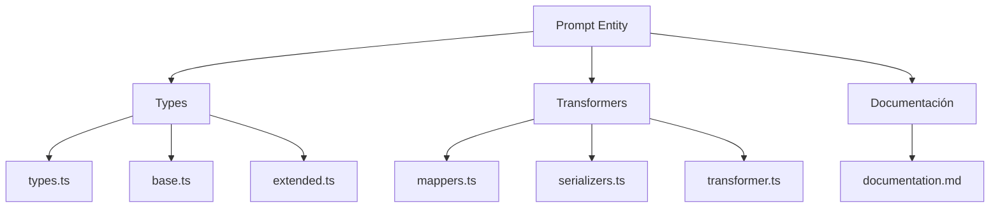
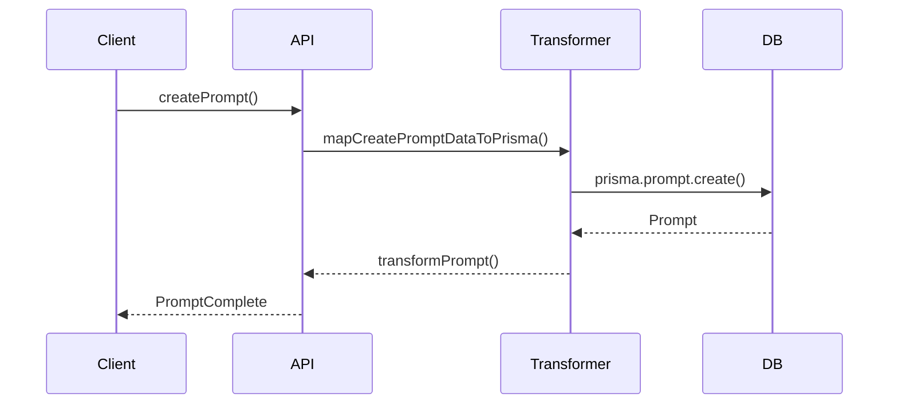

# 💬 Entidad Prompt

## Descripción

La entidad `Prompt` representa instrucciones, frases, plantillas o disparadores que pueden asociarse a imágenes, notas, personajes, conceptos y más. Permite modelar prompts para IA, escritura creativa, generación de imágenes, etc.

## Estructura



## Tipos principales

- `PromptBase`, `PromptComplete`, `PromptCreateInput`, `PromptUpdateInput`
- Filtros: `PromptFilters`, `PromptSearchOptions`, `PromptSearchResult`

## Ejemplo de uso

```typescript
import { createPrompt, updatePrompt, searchPrompts } from '@/transformers/prompt';

const nuevoPrompt = await createPrompt({ text: 'Describe un bosque mágico', type: 'escritura' });
const prompts = await searchPrompts({ filters: { search: 'bosque' } });
await updatePrompt(nuevoPrompt.id, { text: 'Describe un bosque encantado' });
```

## Flujo de datos



## Mejores prácticas

- Usar siempre los tipos canónicos (`PromptCreateInput`, `PromptUpdateInput`, `PromptComplete`).
- Validar los datos antes de crear/actualizar (`validatePrompt`).
- Usar los mapeadores para relaciones complejas.
- Mantener la documentación y diagramas actualizados.

## Integración

Los prompts pueden asociarse a:

- Imágenes, notas, álbumes, personajes, conceptos, grupos, etc.

Al eliminar un prompt, revisar las relaciones para evitar referencias huérfanas.

---

> Última actualización: 2025-06-10
