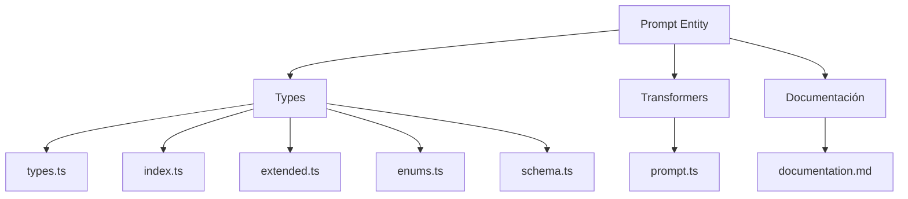
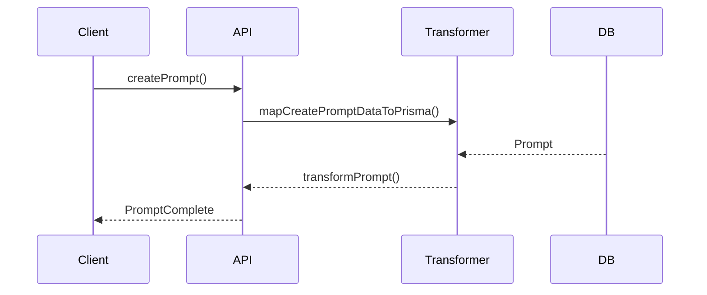

# 💬 Entidad Prompt

## Descripción

La entidad `Prompt` representa instrucciones, frases, plantillas o disparadores que pueden asociarse a imágenes, notas, personajes, conceptos y más. Permite modelar prompts para IA, escritura creativa, generación de imágenes, etc.

## Estructura



## Tipos principales

- `PromptBase`: Tipo base con campos fundamentales
- `PromptComplete`: Tipo completo con relaciones, conteos y campos deserializados
- `CreatePromptData`, `UpdatePromptData`: Inputs para mutaciones
- `PromptParameter`: Parámetros de configuración
- `PromptExecutionParams`: Parámetros para ejecutar prompts

## Ejemplo de uso

```typescript
import { createPrompt, updatePrompt, searchPrompts, executePrompt } from '@/transformers/prompt';

// Crear un nuevo prompt
const nuevoPrompt = await createPrompt({
  name: 'Paisaje fantástico',
  content: 'Un paisaje fantástico con montañas flotantes, cascadas de luz y criaturas místicas',
  purpose: 'Generación de imágenes',
  category: 'image',
  parameters: {
    width: { type: 'number', value: 1024, description: 'Ancho de la imagen' },
    style: { type: 'select', value: 'fantástico', options: ['realista', 'fantástico', 'abstracto'] }
  }
});

// Buscar prompts
const prompts = await searchPrompts({
  filters: {
    query: 'paisaje',
    categories: ['image']
  }
});

// Actualizar un prompt existente
await updatePrompt(nuevoPrompt.id, {
  content: 'Un paisaje onírico con montañas flotantes...'
});

// Ejecutar un prompt con parámetros
const resultado = await executePrompt({
  promptId: nuevoPrompt.id,
  variables: { style: 'acuarela' }
});
```

## Flujo de datos



## Mejores prácticas

- Usar siempre los tipos canónicos (`CreatePromptData`, `UpdatePromptData`, `PromptComplete`).
- Validar los datos antes de crear/actualizar con ZodSchema.
- Serializar/deserializar correctamente los campos JSON (parameters, tags).
- Mantener la documentación y diagramas actualizados.

## Integración

Los prompts pueden asociarse a:

- Imágenes, videos
- Notas, conceptos
- Personajes, lugares, objetos
- Colecciones, álbumes
- Tags, propiedades

## Migración a tipos canónicos

✅ Tipos canónicos migrados, legacy eliminado, documentación y diagrama actualizados.

---

> Última actualización: 2025-06-18
