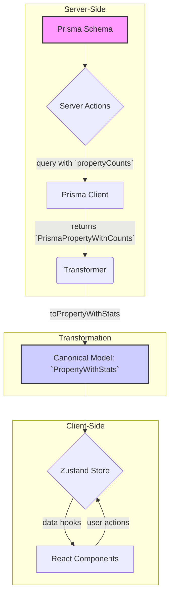

# Documentación de la Entidad `Property`

**Última Actualización:** 2025-01-27

## Arquitectura de Tipos

La entidad `Property` sigue el patrón de arquitectura de tipos estandarizado `EntityWithStats`, diseñado para la eficiencia, consistencia y escalabilidad en toda la aplicación.

### 1. Tipo Canónico: `PropertyWithStats`

El tipo principal y canónico que debe usarse en componentes de React, stores de Zustand y lógica de UI es **`PropertyWithStats`**.

- **Definición**: `src/types/entities/property/base.ts`
- **Interfaz**:

    ```typescript
    interface PropertyWithStats extends PropertyBase {
      stats: PropertyStatistics;
    }
    ```

- **Contiene**:
  - `PropertyBase`: El modelo `Property` base, directamente alineado con `schema.prisma`.
  - `stats`: Un objeto `PropertyStatistics` con metadatos calculados y derivados.

### 2. Estadísticas: `PropertyStatistics`

Este objeto proporciona métricas clave sobre el uso y la completitud de una propiedad sin necesidad de realizar joins o queries adicionales en el cliente.

- **Definición**: `src/types/entities/property/base.ts`
- **Campos**:
  - `totalRelations`: Suma total de todas las relaciones (imágenes, videos, tags, etc.).
  - `usageDiversity`: Número de tipos de entidades diferentes con las que se relaciona esta propiedad.
  - `popularity`: Un score numérico que refleja la popularidad general.
  - `completenessScore`: Un porcentaje que indica qué tan "completo" está el perfil de la propiedad (ej. si tiene descripción, categoría, etc.).

### 3. Tipos de Prisma

- **`PrismaPropertyWithCounts`**: Es el tipo que se recibe directamente de las consultas de Prisma que usan el `include` de `propertyCounts`. Contiene el modelo base y un objeto `_count` con el número de relaciones.
- **`propertyCounts`**: Objeto de configuración de Prisma (`Prisma.PropertyInclude`) exportado desde `src/types/entities/property/base.ts`. Se usa en las **Server Actions** para obtener los conteos de manera eficiente.

## Flujo de Datos

1. **Server Actions (`@/app/actions/properties`)**:
    - Las funciones (`getProperties`, `getProperty`, etc.) usan `prisma.property.findMany/findUnique`.
    - **IMPRESCINDIBLE**: Todas las consultas deben incluir el objeto `propertyCounts` para obtener los `_count` de las relaciones.
    - **Ejemplo**: `include: propertyCounts`

2. **Transformers (`@/transformers/property`)**:
    - La función `toPropertyWithStats` (en `mappers.ts`) es la única responsable de convertir el dato de Prisma (`PrismaPropertyWithCounts`) al tipo canónico (`PropertyWithStats`).
    - Calcula todas las `PropertyStatistics` a partir del objeto `_count`.

3. **Zustand Store (`@/store/entities/property`)**:
    - El store solo debe almacenar objetos del tipo `PropertyWithStats`.
    - La lógica de negocio y las llamadas a las server actions están en el slice `core.ts`.
    - El estado se normaliza en `properties: Record<string, PropertyWithStats>`.

4. **Componentes de React**:
    - Los componentes deben consumir los datos del store de Zustand.
    - Deben usar `PropertyWithStats` para mostrar tanto los datos base como las estadísticas.
    - Para las mutaciones (crear, actualizar), deben llamar a las acciones expuestas por el store (`createProperty`, `updateProperty`, etc.).

## Diagrama de Flujo


