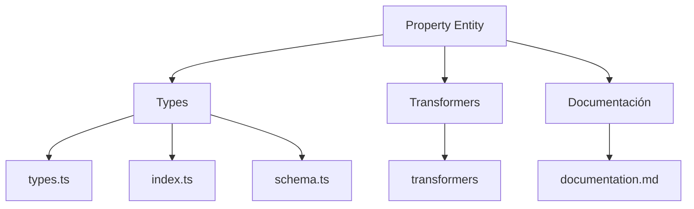
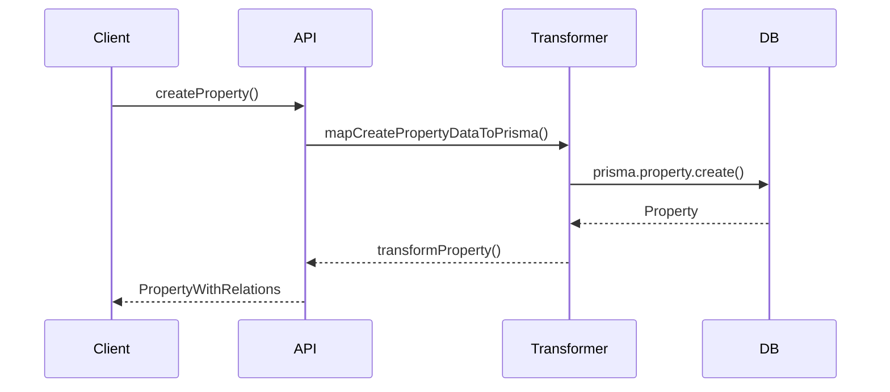

# 🔍 Entidad Property

## Descripción

La entidad `Property` representa atributos, características o propiedades que pueden asociarse a imágenes, notas, personajes, conceptos, world items y más. Permite modelar metadatos, atributos personalizados y características configurables.

## Estructura



## Tipos principales

- `PropertyBase`: Tipo base con campos fundamentales
- `PropertyCreateInput`: Input para creación de propiedades
- `PropertyUpdateInput`: Input para actualización de propiedades
- `PropertyRelations`: Relaciones con otras entidades
- `PropertyWithRelations`: Propiedad con todas sus relaciones
- `PropertySortCriteria`: Enum para criterios de ordenación
- `PropertyViewMode`: Enum para modos de visualización

## Ejemplo de uso

```typescript
import { createProperty, updateProperty, getProperty } from '@/transformers/property';
import { PropertySortCriteria } from '@/types/entities/property';

// Crear una nueva propiedad
const nuevaPropiedad = await createProperty({
  name: 'Potencia',
  emoji: '⚡',
  color: '#fbbf24',
  category: 'stats',
  description: 'Nivel de potencia del elemento'
});

// Obtener una propiedad existente
const propiedad = await getProperty(nuevaPropiedad.id);

// Actualizar una propiedad existente
await updateProperty(nuevaPropiedad.id, {
  emoji: '💪',
  color: '#ef4444',
  isFavorite: true
});
```

## Flujo de datos



## Mejores prácticas

- Usar siempre los tipos canónicos (`PropertyBase`, `PropertyCreateInput`, `PropertyUpdateInput`, `PropertyWithRelations`).
- Validar los datos antes de crear/actualizar con `PropertySchema`, `CreatePropertySchema` o `UpdatePropertySchema`.
- Utilizar los enums `PropertySortCriteria` y `PropertyViewMode` para garantizar valores válidos.
- Categorizar propiedades para facilitar su organización y búsqueda.
- Asignar colores y emojis descriptivos para mejorar la experiencia visual.

## Integración

Las propiedades pueden integrarse con:

- Imágenes, videos, álbumes y colecciones
- Notas, prompts, conceptos y personajes
- Lugares, world items y wildcards
- Filtros avanzados y búsquedas personalizadas
- Personalización de UI y visualización de datos

## Migración a tipos canónicos

✅ Tipos canónicos migrados, documentación y diagrama actualizados.

---

> Última actualización: 2025-06-18
