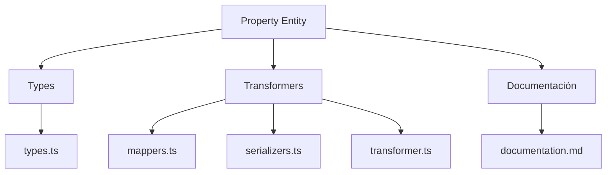
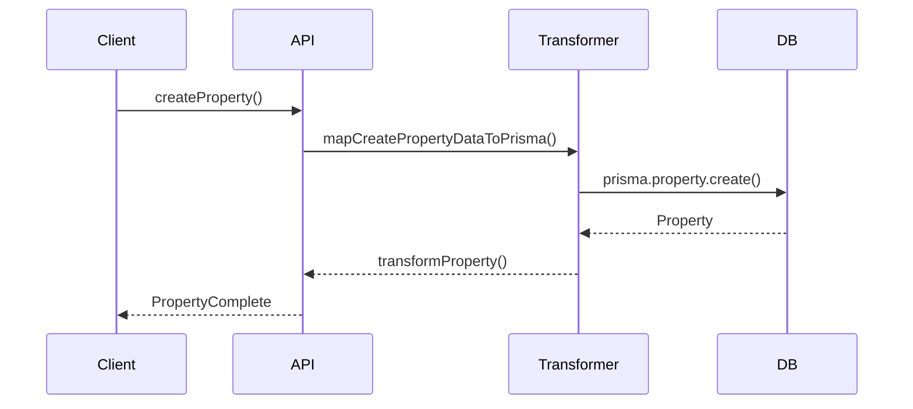

# 🏷️ Entidad Property

## Descripción

La entidad `Property` representa atributos, características o propiedades que pueden asociarse a imágenes, notas, personajes, conceptos, world items y más. Permite modelar metadatos, atributos personalizados, etc.

## Estructura



## Tipos principales

- `PropertyBase`, `PropertyComplete`, `PropertyCreateInput`, `PropertyUpdateInput`
- Filtros: `PropertyFilters`, `PropertySearchOptions`, `PropertySearchResult`

## Ejemplo de uso

```typescript
import { createProperty, updateProperty, searchProperties } from '@/transformers/property';

const nuevaProp = await createProperty({ name: 'Rareza', value: 'Épica' });
const props = await searchProperties({ filters: { search: 'Rareza' } });
await updateProperty(nuevaProp.id, { value: 'Legendaria' });
```

## Flujo de datos



## Mejores prácticas

- Usar siempre los tipos canónicos (`PropertyCreateInput`, `PropertyUpdateInput`, `PropertyComplete`).
- Validar los datos antes de crear/actualizar (`validateProperty`).
- Usar los mapeadores para relaciones complejas.
- Mantener la documentación y diagramas actualizados.

## Integración

Las propiedades pueden asociarse a:

- Imágenes, notas, álbumes, personajes, conceptos, world items, prompts, grupos, etc.

Al eliminar una propiedad, revisar las relaciones para evitar referencias huérfanas.

---

> Última actualización: 2025-06-10
