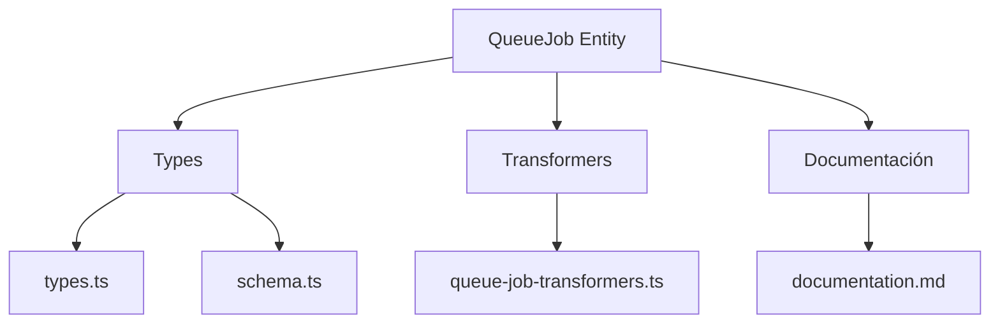
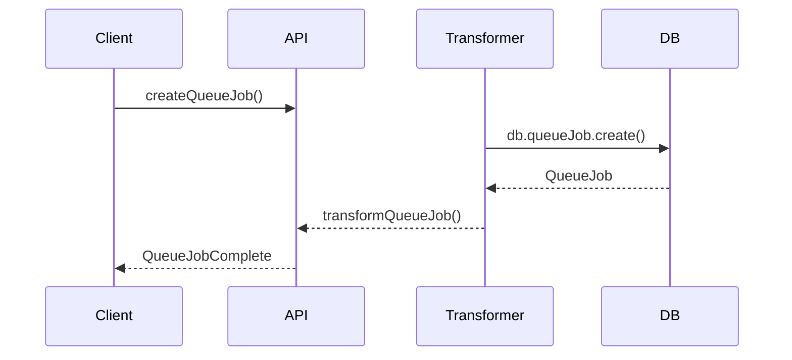

# 🕒 Entidad QueueJob

## Descripción

La entidad `QueueJob` representa trabajos encolados o tareas asíncronas dentro del sistema, como procesamiento de imágenes, generación de miniaturas, tareas de IA, etc.

---

## Estructura



---

## Tipos principales

- `QueueJobBase`, `QueueJobComplete`, `QueueJobCreateInput`, `QueueJobUpdateInput`
- Filtros: `QueueJobFilters`, `QueueJobSearchOptions`, `QueueJobSearchResult`

---

## Ejemplo de uso

```typescript
import { createQueueJob, updateQueueJob, searchQueueJobs } from '@/transformers/queue-job/queue-job-transformers';

const job = await createQueueJob({ type: 'thumbnail', status: 'pending' });
const jobs = await searchQueueJobs({ filters: { status: 'pending' } });
await updateQueueJob(job.id, { status: 'completed' });
```

---

## Flujo de datos



---

## Mejores prácticas

- Usar siempre los tipos canónicos (`QueueJobCreateInput`, `QueueJobUpdateInput`, `QueueJobComplete`).
- Validar los datos antes de crear/actualizar (`validateQueueJob`).
- Usar los mapeadores para relaciones complejas.
- Mantener la documentación y diagramas actualizados.

---

## Integración

Los QueueJobs pueden asociarse a:

- Imágenes, álbumes, colecciones, procesos automáticos, etc.

Al eliminar un QueueJob, revisar las relaciones para evitar referencias huérfanas.

---

> Última actualización: 2025-06-10
