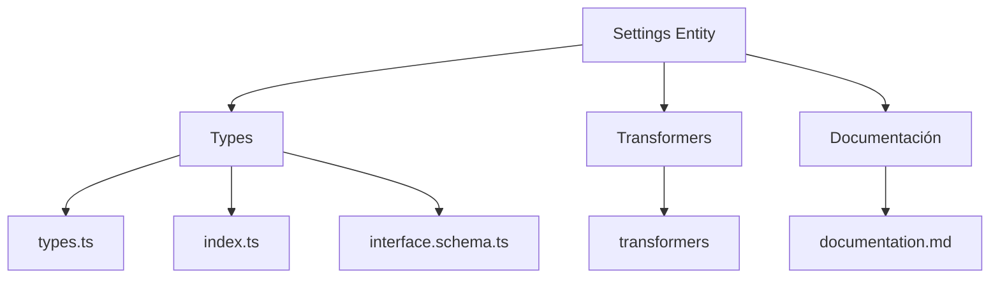
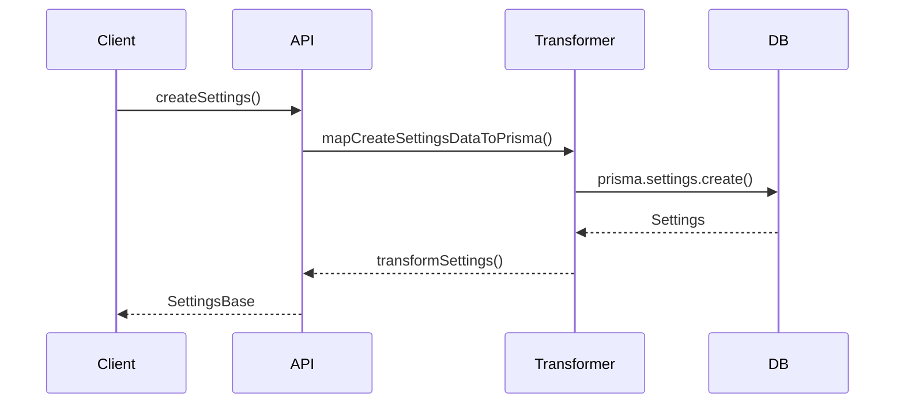

# ⚙️ Entidad Settings

## Descripción

La entidad `Settings` representa las configuraciones y preferencias de usuario o del sistema. Almacena ajustes como el tema visual, idioma, y otras preferencias específicas que afectan la experiencia del usuario en la aplicación.

## Estructura



## Tipos principales

- `SettingsBase`: Tipo base con campos fundamentales
- `SettingsCreateInput`: Input para creación de configuraciones
- `SettingsUpdateInput`: Input para actualización de configuraciones
- `InterfacePreferences`: Preferencias de interfaz de usuario (UI)
- `InterfaceSettingsState`: Estado de configuraciones de interfaz

## Ejemplo de uso

```typescript
import { createSettings, updateSettings, getSettings } from '@/transformers/settings';

// Crear nuevas configuraciones
const nuevasSettings = await createSettings({
  theme: 'dark',
  language: 'es',
  profileId: 'profile-123',
  data: {
    fontFamily: 'system',
    fontSize: 'md',
    animations: true,
    thumbnailsRespectAspectRatio: true,
    thumbnailsBorderRadius: {
      grid: 8,
      card: 12,
      mosaic: 4
    },
    thumbnailsAnimations: true,
    thumbnailsUltraPerformance: false
  }
});

// Obtener configuraciones existentes
const settings = await getSettings(nuevasSettings.id);

// Actualizar configuraciones existentes
await updateSettings(nuevasSettings.id, {
  theme: 'light',
  data: {
    thumbnailsAnimations: false,
    thumbnailsUltraPerformance: true
  }
});
```

## Flujo de datos



## Mejores prácticas

- Usar siempre los tipos canónicos (`SettingsBase`, `SettingsCreateInput`, `SettingsUpdateInput`).
- Validar datos de interfaz con `interfacePreferencesSchema` antes de persistir.
- El campo `data` es de tipo `unknown` y debe ser tratado con precaución (tipado y validado).
- Separar las configuraciones del sistema de las preferencias de usuario.
- Aplicar cambios de configuración inmediatamente para reflejarse en la UI.

## Integración

Las configuraciones pueden integrarse con:

- Tema y apariencia visual de la aplicación
- Configuración de idioma y localización
- Preferencias de visualización de miniaturas y elementos
- Comportamiento de la interfaz (animaciones, rendimiento)
- Opciones de accesibilidad

## Migración a tipos canónicos

✅ Tipos canónicos migrados, documentación y diagrama actualizados.

---

> Última actualización: 2025-06-18