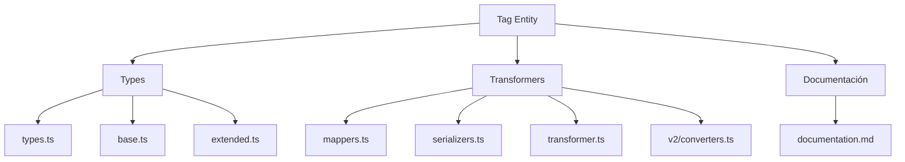
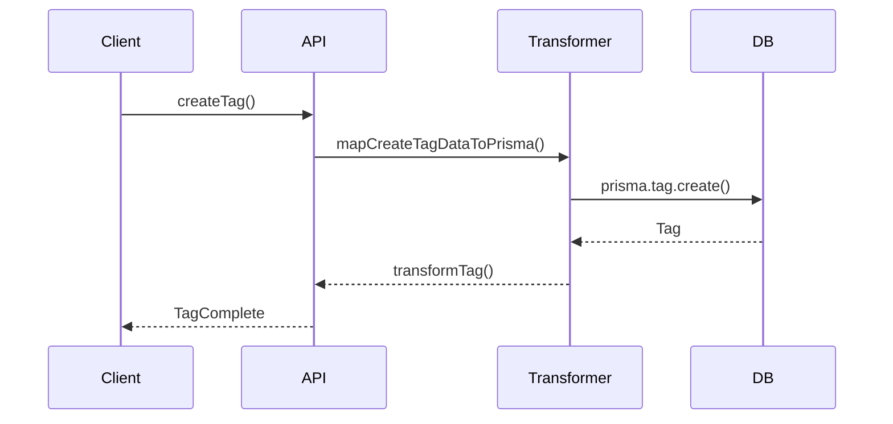

# 🏷️ Entidad Tag

## Descripción

La entidad `Tag` representa etiquetas que pueden asociarse a imágenes, videos, notas y otros elementos del sistema para organización, filtrado y categorización avanzada.

## Estructura



## Tipos principales

- `TagBase`: Estructura base de la etiqueta.
- `TagComplete`: Incluye relaciones y conteos.
- `TagCreateInput` / `TagUpdateInput`: Para creación y actualización.
- `TagFilters`, `TagSearchOptions`, `TagSearchResult`: Para búsquedas y filtrado.

## Ejemplo de uso

```typescript
import { createTag, updateTag, searchTags } from '@/transformers/tag';

// Crear una etiqueta
const nuevaTag = await createTag({ name: 'Inspiración', color: '#f59e42' });

// Buscar etiquetas favoritas
const favoritas = await searchTags({ where: { isFavorite: true } });

// Actualizar una etiqueta
await updateTag(nuevaTag.id, { color: '#3b82f6' });
```

## Flujo de datos



## Mejores prácticas

- Usar siempre los tipos canónicos (`TagCreateInput`, `TagUpdateInput`, `TagComplete`).
- Validar los datos antes de crear/actualizar (`validateTag`).
- Usar los mapeadores para relaciones complejas.
- Mantener la documentación y diagramas actualizados.

## Integración

Las etiquetas pueden asociarse a:

- Imágenes, videos, álbumes, colecciones
- Notas, prompts, conceptos, personajes, lugares, etc.

Al eliminar una etiqueta, revisar las relaciones para evitar referencias huérfanas.

---

> Última actualización: 2025-06-10
