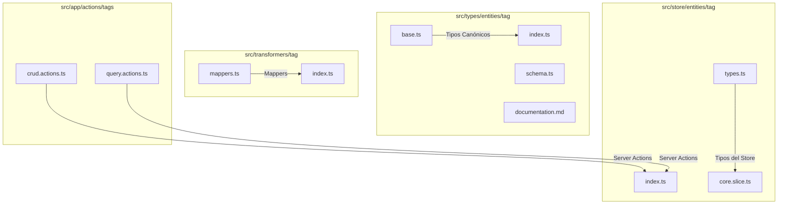
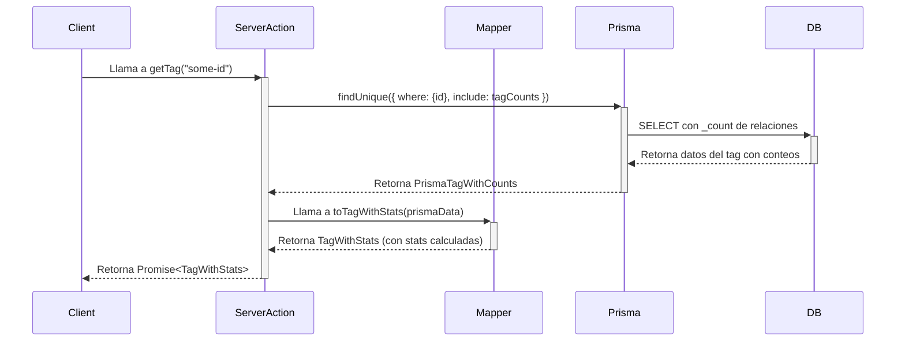

# 🏷️ Entidad Tag

## ✅ Descripción

La entidad `Tag` representa etiquetas que pueden asociarse a otras entidades del sistema. Ha sido refactorizada para usar el patrón **`EntityWithStats`**, lo que significa que cada objeto `Tag` viene enriquecido con metadatos y estadísticas calculadas para un rendimiento y consistencia óptimos.

## 🏗️ Estructura de Archivos



## ✨ Tipos Principales (Canonical Types)

- `TagBase`: El tipo base generado por Prisma.
- `TagWithStats`: El tipo canónico para la aplicación. Extiende `TagBase` con un objeto `stats` que contiene métricas calculadas.
- `PrismaTagWithCounts`: Tipo interno que representa un tag con los `_count` de sus relaciones, usado por el mapper.
- `tagCounts`: Objeto de Prisma para incluir eficientemente los conteos en las consultas.

## 🚀 Ejemplo de Uso (Server Actions)

```typescript
import { createTag, getTags } from '@/app/actions/tags/crud.actions';
import { Prisma } from '@prisma/client';

// 1. Crear un nuevo tag
const newTagData: Prisma.TagCreateInput = {
  name: 'Estilo Artístico',
  emoji: '🎨',
  color: '#8b5cf6',
  category: 'style',
  description: 'Tags relacionados con estilos artísticos y visuales.'
};
const newTag = await createTag(newTagData);
// newTag es de tipo TagWithStats

console.log(newTag.stats.popularity); // Acceder a estadísticas calculadas

// 2. Obtener todos los tags
const allTags = await getTags(); // Retorna Promise<TagWithStats[]>
```

## 🌊 Flujo de Datos

El flujo sigue un patrón `Server Action -> Mapper -> Prisma`.



## 📋 Mejores Prácticas

- **Usar `TagWithStats`**: Es el tipo de dato principal que debe fluir por la aplicación.
- **Server Actions**: Toda la lógica de negocio y acceso a datos debe realizarse a través de las server actions refactorizadas.
- **Consultas Eficientes**: Utilizar siempre `include: tagCounts` en las consultas de Prisma para obtener los datos necesarios para las estadísticas sin cargar las relaciones completas.
- **Tipos de Input de Prisma**: Para crear o actualizar, usar los tipos `Prisma.TagCreateInput` y `Prisma.TagUpdateInput`.
- **Estado en el cliente**: El store de Zustand (`useTagStore`) está optimizado para manejar `TagWithStats`.

## 🔄 Estado de la Migración

✅ **COMPLETADO**: La entidad `Tag` ha sido completamente refactorizada al patrón `EntityWithStats`. Se han actualizado tipos, transformadores, server actions y el store de Zustand. Se eliminaron los archivos legacy.

---

> Última actualización: 2025-01-27
