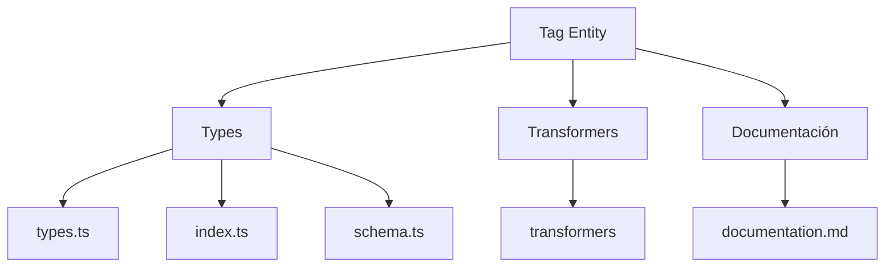
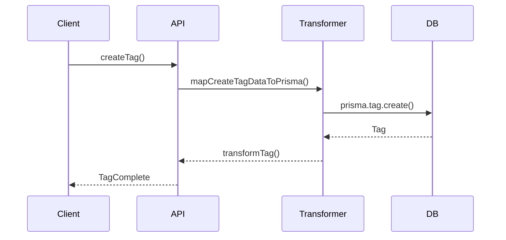

# 🏷️ Entidad Tag

## Descripción

La entidad `Tag` representa etiquetas que pueden asociarse a imágenes, videos, notas y otros elementos del sistema para organización, filtrado y categorización avanzada.

## Estructura



## Tipos principales

- `TagBase`: Tipo base con campos fundamentales
- `TagCreateInput`: Input para creación de etiquetas
- `TagUpdateInput`: Input para actualización de etiquetas
- `TagComplete`: Tag con todas sus relaciones y conteos
- `TagCategory`: Enum para categorías de etiquetas (general, subject, style, etc.)
- `TagSortCriteria`: Enum para criterios de ordenación

## Ejemplo de uso

```typescript
import { createTag, updateTag, getTags } from '@/transformers/tag';
import { TagCategory } from '@/types/entities/tag';

// Crear una etiqueta
const nuevaTag = await createTag({
  name: 'Naturaleza',
  emoji: '🌲',
  color: '#4ade80',
  category: TagCategory.SUBJECT,
  description: 'Imágenes relacionadas con la naturaleza'
});

// Obtener etiquetas por categoría
const tagsPorCategoria = await getTags({
  where: { categories: [TagCategory.SUBJECT] }
});

// Actualizar una etiqueta
await updateTag(nuevaTag.id, {
  color: '#3b82f6',
  isFavorite: true
});
```

## Flujo de datos



## Mejores prácticas

- Usar siempre los tipos canónicos (`TagBase`, `TagCreateInput`, `TagUpdateInput`, `TagComplete`).
- Validar los datos antes de crear/actualizar con `TagSchema`.
- Utilizar los enums `TagCategory` y `TagSortCriteria` para garantizar valores válidos.
- Establecer siempre `emoji` y `color` para mejorar la visualización en la UI.
- Configurar `isFavorite` para etiquetas de uso frecuente.

## Integración

Las etiquetas pueden integrarse con:

- Imágenes, videos, álbumes, colecciones
- Notas, prompts, conceptos, personajes, lugares
- Grupos, propiedades y otros elementos del sistema
- Búsquedas y filtros avanzados

## Migración a tipos canónicos

✅ Tipos canónicos migrados, legacy eliminado, documentación y diagrama actualizados.

---

> Última actualización: 2025-06-18
