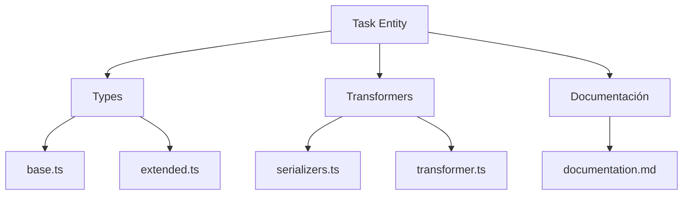
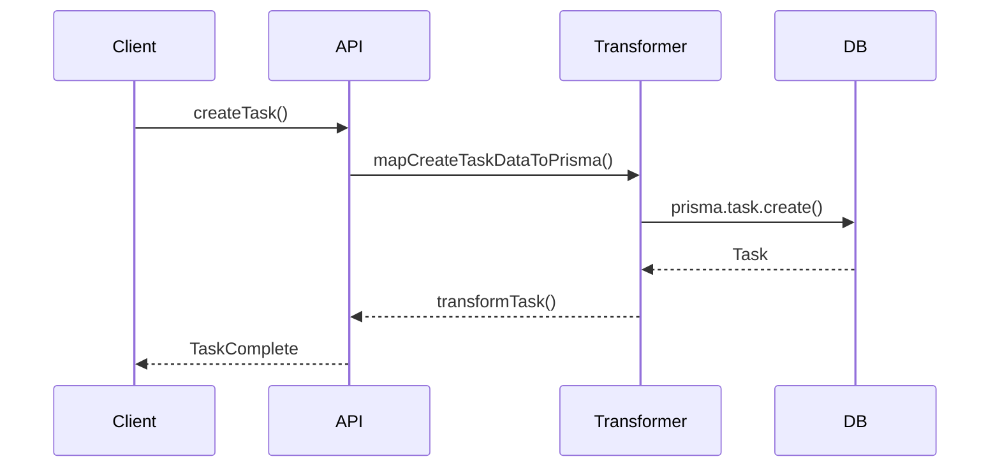

# ✅ Entidad Task

## Descripción

La entidad `Task` representa tareas, acciones o procesos pendientes/automatizados dentro del sistema. Permite modelar flujos de trabajo, acciones programadas, tareas de procesamiento, etc.

---

## Estructura



---

## Tipos principales

- `TaskBase`, `TaskComplete`, `TaskCreateInput`, `TaskUpdateInput`
- Filtros: `TaskFilters`, `TaskSearchOptions`, `TaskSearchResult`

---

## Ejemplo de uso

```typescript
import { createTask, updateTask, searchTasks } from '@/transformers/task';

const nuevaTarea = await createTask({ name: 'Procesar imágenes', status: 'pending' });
const tareas = await searchTasks({ filters: { status: 'pending' } });
await updateTask(nuevaTarea.id, { status: 'completed' });
```

---

## Flujo de datos



---

## Mejores prácticas

- Usar siempre los tipos canónicos (`TaskCreateInput`, `TaskUpdateInput`, `TaskComplete`).
- Validar los datos antes de crear/actualizar (`validateTask`).
- Usar los mapeadores para relaciones complejas.
- Mantener la documentación y diagramas actualizados.

---

## Integración

Las tareas pueden asociarse a:

- Imágenes, álbumes, colecciones, usuarios, procesos automáticos, etc.

Al eliminar una tarea, revisar las relaciones para evitar referencias huérfanas.

---

> Última actualización: 2025-06-10
