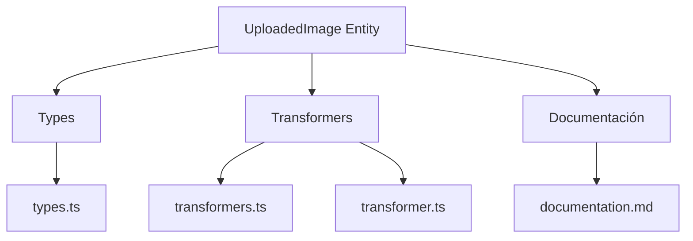
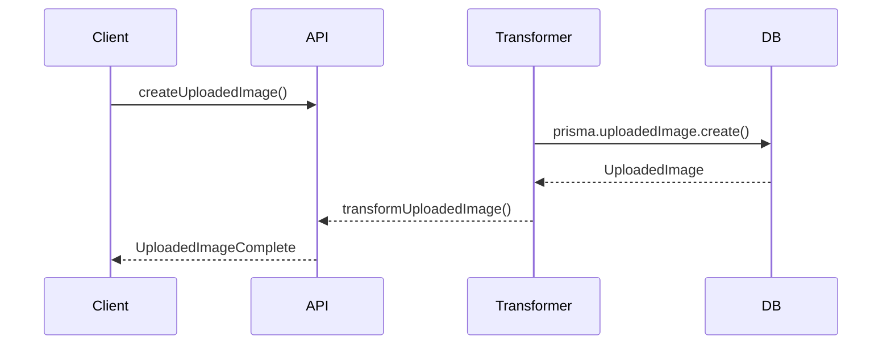

# ⬆️ Entidad UploadedImage

## Descripción

La entidad `UploadedImage` representa imágenes subidas temporalmente al sistema, antes de ser procesadas, validadas o asociadas a entidades principales como Image, Album, etc.

---

## Estructura



---

## Tipos principales

- `UploadedImageBase`, `UploadedImageComplete`, `UploadedImageCreateInput`, `UploadedImageUpdateInput`
- Filtros: `UploadedImageFilters`, `UploadedImageSearchOptions`, `UploadedImageSearchResult`

### Campos principales

- **id**: identificador único de la imagen subida
- **name**: nombre asignado a la imagen
- **path**: ruta de almacenamiento
- **type**: tipo de archivo (`image`, `video`, etc.)
- **category**: categoría para clasificar la subida
- **hash**: hash para detección de duplicados
- **imageId**: referencia a la imagen procesada
- **size**: tamaño en bytes
- **width** y **height**: dimensiones originales
- **metadata**: cadena JSON con metadatos opcionales
- **uploadedAt**: fecha de carga
- **createdAt** y **updatedAt**: timestamps de auditoría

---

## Ejemplo de uso

```typescript
import { createUploadedImage, processUploadedImage, searchUploadedImages } from '@/transformers/uploaded-image/transformer';

const upload = await createUploadedImage({ file: fileObject });
const procesada = await processUploadedImage(upload.id);
const uploads = await searchUploadedImages({ filters: { status: 'pending' } });
```

---

## Flujo de datos



---

## Mejores prácticas

- Usar siempre los tipos canónicos (`UploadedImageCreateInput`, `UploadedImageUpdateInput`, `UploadedImageComplete`).
- Validar los datos antes de crear/actualizar (`validateUploadedImage`).
- Usar los mapeadores para relaciones complejas.
- Mantener la documentación y diagramas actualizados.

---

## Integración

Las imágenes subidas pueden asociarse a:

- Imágenes, álbumes, colecciones, procesos automáticos, etc.

Al eliminar una imagen subida, revisar las relaciones para evitar referencias huérfanas.

---

> Última actualización: 2025-06-11
