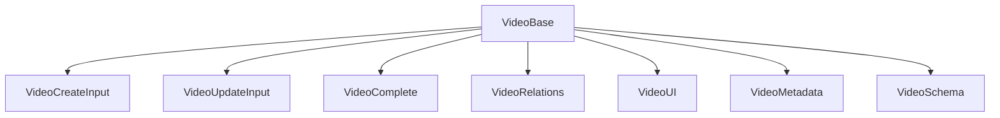

# 🎬 Video: Tipos y Esquemas Canónicos

Este módulo define los **tipos canónicos** y el esquema Zod para la entidad `Video`, alineados con el modelo de dominio y las reglas del proyecto.

## 📦 Estructura



- `VideoBase`: Tipo canónico alineado a la base de datos.
- `VideoComplete`: Tipo enriquecido para relaciones y UI.
- `VideoCreateInput`, `VideoUpdateInput`: Inputs para mutaciones.
- `VideoSchema`: Esquema Zod para validación.

## 🚨 Notas de migración

- **Legacy eliminado:** Solo se exportan tipos y enums canónicos.
- **No importar tipos de Prisma ni archivos legacy.**
- **Validar siempre con VideoSchema antes de persistir.**

## 📝 Ejemplo de uso

```ts
import type { VideoBase, VideoCreateInput } from '@/types/entities/video';
import { VideoSchema } from '@/types/entities/video/types';

const nuevo: VideoCreateInput = { name: 'Demo', path: '/videos/demo.mp4', hash: 'xyz', size: 1000, duration: 60, isPublic: true, isFavorite: false, folderId: 'f1', description: null, width: 1920, height: 1080, metadata: null, thumbnail: null, thumbnailSize: null, thumbnailWidth: null, thumbnailHeight: null };
const validado = VideoSchema.parse(nuevo);
```

---

> Última actualización: 2025-06-18
> Responsable: migración y limpieza de tipos canónicos
