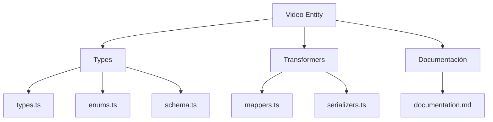
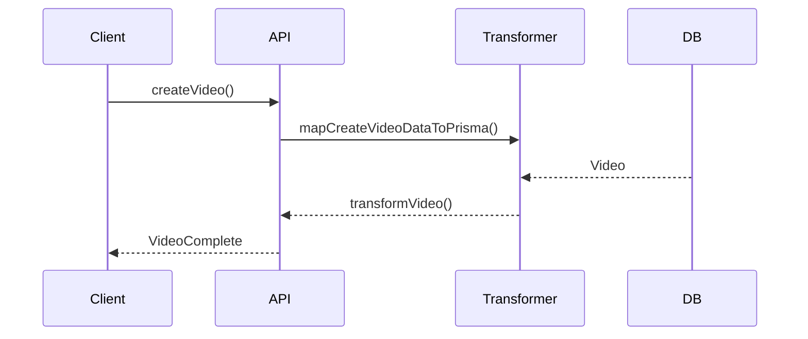

# 🎬 Entidad Video

## Descripción

La entidad `Video` representa archivos de video almacenados en el sistema, incluyendo metadatos, relaciones y atributos multimedia. Permite asociar videos a álbumes, colecciones, personajes, lugares, notas, etc.

---

## Estructura



---

## Tipos principales

- `VideoBase`, `VideoComplete`, `VideoCreateInput`, `VideoUpdateInput`
- Filtros: `VideoFilters`, `VideoSearchOptions`, `VideoSearchResult`

---

## Ejemplo de uso

```typescript
import { createVideo, updateVideo, searchVideos } from '@/transformers/video/serializers';

const nuevoVideo = await createVideo({ name: 'Demo', url: '/uploads/demo.mp4' });
const videos = await searchVideos({ filters: { search: 'Demo' } });
await updateVideo(nuevoVideo.id, { description: 'Video de demostración.' });
```

---

## Flujo de datos



---

## Mejores prácticas

- Usar siempre los tipos canónicos (`VideoCreateInput`, `VideoUpdateInput`, `VideoComplete`).
- Validar los datos antes de crear/actualizar (`validateVideo`).
- Usar los mapeadores para relaciones complejas.
- Mantener la documentación y diagramas actualizados.

---

## Integración

Los videos pueden asociarse a:

- Álbumes, colecciones, personajes, lugares, notas, conceptos, prompts, grupos, etc.

Al eliminar un video, revisar las relaciones para evitar referencias huérfanas.

---

> Última actualización: 2025-06-10
