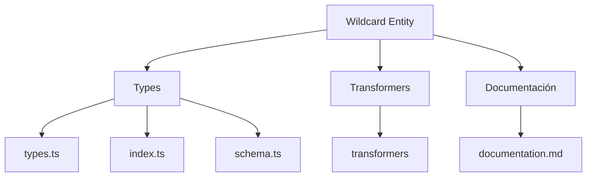
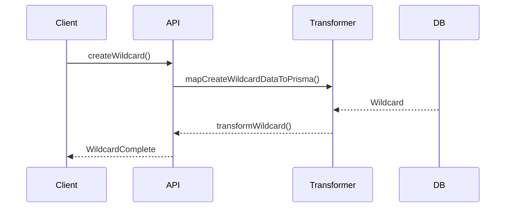

# 🃏 Entidad Wildcard

## Descripción

La entidad `Wildcard` representa comodines, plantillas o variables dinámicas que pueden ser utilizadas en prompts, nombres, descripciones y otros campos del sistema para generar contenido dinámico o parametrizable.

## Estructura



## Tipos principales

- `WildcardBase`: Tipo base con campos fundamentales
- `WildcardCreateInput`: Input para creación de wildcards
- `WildcardUpdateInput`: Input para actualización de wildcards
- `WildcardComplete`: Wildcard con todas sus relaciones y conteos
- `WildcardChild`: Estructura de hijos de un wildcard
- `WildcardSortCriteria`: Enum para criterios de ordenación
- `WildcardViewMode`: Enum para modos de visualización

## Ejemplo de uso

```typescript
import { createWildcard, updateWildcard, getWildcard } from '@/transformers/wildcard';
import { WildcardSortCriteria } from '@/types/entities/wildcard';

// Crear un nuevo wildcard
const nuevoWildcard = await createWildcard({
  name: 'Nombres',
  emoji: '👤',
  color: '#8b5cf6',
  category: 'personal',
  children: JSON.stringify(['Ana', 'Carlos', 'Elena', 'Miguel', 'Laura'])
});

// Obtener wildcards por categoría
const wildcardsPorCategoria = await getWildcards({
  filters: { categories: ['personal'] },
  sortBy: WildcardSortCriteria.NAME_ASC
});

// Actualizar un wildcard existente
await updateWildcard(nuevoWildcard.id, {
  children: JSON.stringify(['Ana', 'Carlos', 'Elena', 'Miguel', 'Laura', 'David', 'Sofía']),
  isFavorite: true
});
```

## Flujo de datos



## Mejores prácticas

- Usar siempre los tipos canónicos (`WildcardBase`, `WildcardCreateInput`, `WildcardUpdateInput`, `WildcardComplete`).
- Validar los datos antes de crear/actualizar con `WildcardSchema`, `CreateWildcardSchema` o `UpdateWildcardSchema`.
- Utilizar los enums `WildcardSortCriteria` y `WildcardViewMode` para garantizar valores válidos.
- Organizar los wildcards en categorías para facilitar su búsqueda.
- Manejar correctamente la serialización/deserialización del campo `children` (siempre como JSON string).
- Establecer relaciones jerárquicas para wildcards complejos usando `parentId`.

## Integración

Los wildcards pueden integrarse con:

- Generación de prompts dinámicos
- Sustitución de valores en textos y descripciones
- Automatización de creación de contenido
- Plantillas para nombres, descripciones y metadatos
- Sistemas de categorización y etiquetado dinámico

## Migración a tipos canónicos

✅ Tipos canónicos migrados, documentación y diagrama actualizados.

---

> Última actualización: 2025-06-18
