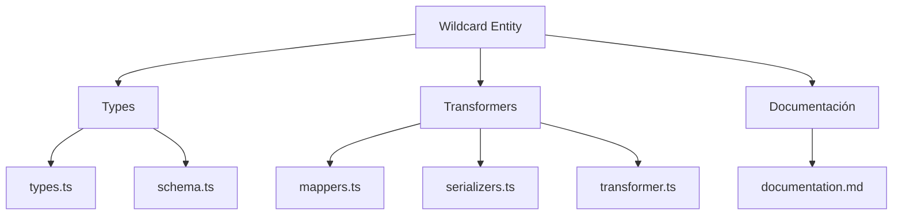
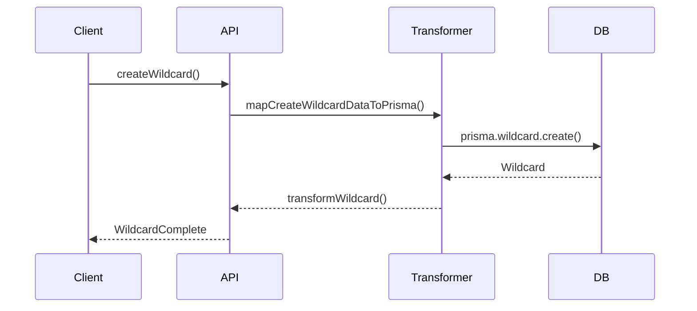

# 🃏 Entidad Wildcard

## Descripción

La entidad `Wildcard` representa comodines, plantillas o variables dinámicas que pueden ser utilizadas en prompts, nombres, descripciones y otros campos del sistema para generar contenido dinámico o parametrizable.

---

## Estructura



---

## Tipos principales

- `WildcardBase`, `WildcardComplete`, `WildcardCreateInput`, `WildcardUpdateInput`
- Filtros: `WildcardFilters`, `WildcardSearchOptions`, `WildcardSearchResult`

---

## Ejemplo de uso

```typescript
import { createWildcard, updateWildcard, searchWildcards } from '@/transformers/wildcard/transformer';

const nuevoWildcard = await createWildcard({ key: 'nombre', value: '{nombreAleatorio}' });
const wildcards = await searchWildcards({ filters: { key: 'nombre' } });
await updateWildcard(nuevoWildcard.id, { value: '{nombreReal}' });
```

---

## Flujo de datos



---

## Mejores prácticas

- Usar siempre los tipos canónicos (`WildcardCreateInput`, `WildcardUpdateInput`, `WildcardComplete`).
- Validar los datos antes de crear/actualizar (`validateWildcard`).
- Usar los mapeadores para relaciones complejas.
- Mantener la documentación y diagramas actualizados.

---

## Integración

Los wildcards pueden asociarse a:

- Prompts, conceptos, propiedades, descripciones, etc.

Al eliminar un wildcard, revisar las relaciones para evitar referencias huérfanas.

---

> Última actualización: 2025-06-10
