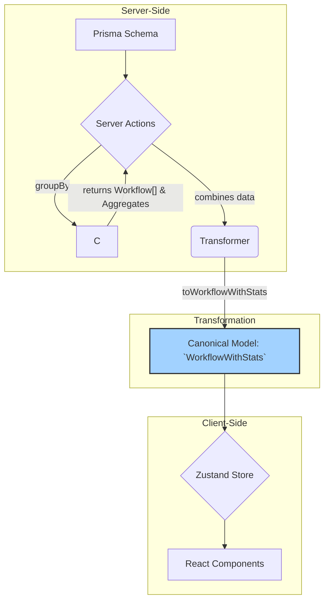

# Documentación de la Entidad `Workflow`

**Última Actualización:** 2025-01-27

## Arquitectura de Tipos: Patrón `WorkflowWithStats`

La entidad `Workflow` introduce un nuevo patrón de tipos, `WorkflowWithStats`, diseñado para entidades que representan procesos o archivos, donde las métricas de uso y rendimiento son más importantes que la diversidad de relaciones.

### 1. Tipo Canónico: `WorkflowWithStats`

El tipo principal que debe usarse en toda la aplicación para representar un workflow.

- **Definición**: `src/types/entities/workflow/base.ts`
- **Interfaz**:

    ```typescript
    interface WorkflowWithStats extends WorkflowBase {
      stats: WorkflowStatistics;
    }
    ```

- **Contiene**:
  - `WorkflowBase`: El modelo `Workflow` base de Prisma.
  - `stats`: Un objeto `WorkflowStatistics` con métricas de ejecución y complejidad.

### 2. Estadísticas: `WorkflowStatistics`

Este objeto proporciona métricas clave sobre la ejecución y estructura de un workflow.

- **Definición**: `src/types/entities/workflow/base.ts`
- **Campos**:
  - `totalExecutions`: Conteo total de veces que el workflow ha sido ejecutado.
  - `successRate`: Porcentaje de ejecuciones completadas con éxito.
  - `averageDuration`: Duración promedio de ejecución en milisegundos.
  - `lastExecutedAt`: Fecha de la última vez que se ejecutó.
  - `nodeCount`: Número de nodos en la definición del workflow.
  - `connectionCount`: Número de conexiones entre nodos en la definición.

## Flujo de Datos

1. **Server Actions (`@/app/actions/workflow`)**:
    - La función `getWorkflows` es la responsable de obtener los datos.
    - Realiza una consulta para obtener todos los `Workflow`.
    - Realiza **consultas de agregación** en `WorkflowExecution` para calcular las estadísticas de todos los workflows de forma eficiente (evitando N+1 queries).
    - Usa un `Map` para asociar las estadísticas a cada workflow.

2. **Transformers (`@/transformers/workflow`)**:
    - La función `toWorkflowWithStats` (en `mappers.ts`) recibe el `Workflow` de Prisma y el objeto de agregados de sus ejecuciones.
    - Parsea de forma segura la `definition` JSON para contar nodos/conexiones.
    - Calcula las `WorkflowStatistics` y las combina con el `WorkflowBase` para producir el `WorkflowWithStats` canónico.

3. **Zustand Store (`@/store/entities/workflow`)**:
    - Sigue el patrón de slices (`core`, `ui`, `filters`).
    - El store solo almacena objetos del tipo `WorkflowWithStats`.
    - La lógica de negocio y las llamadas a las server actions están en `core.slice.ts`.
    - El estado se normaliza en `workflows: Record<string, WorkflowWithStats>`.

## Diagrama de Flujo


