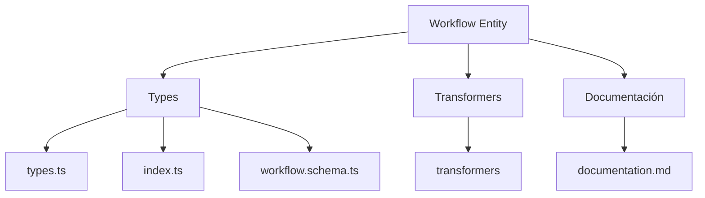
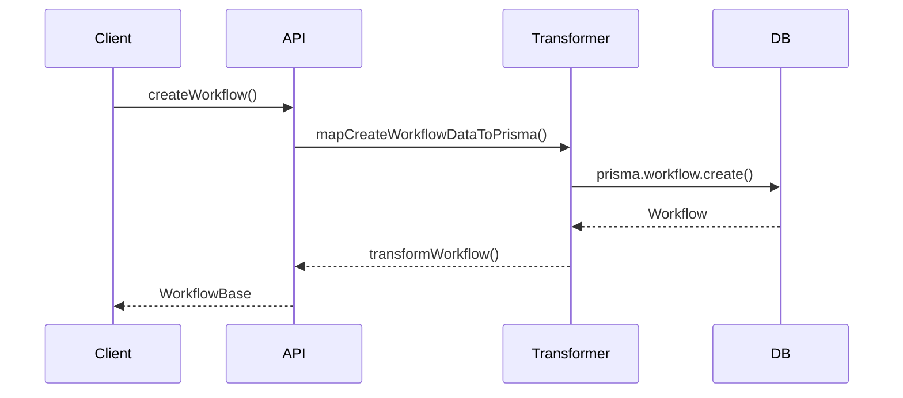

# ⚙️ Entidad Workflow

## Descripción

La entidad `Workflow` representa flujos de trabajo automatizados o conjuntos de tareas que se pueden ejecutar en secuencia. Estos workflows pueden estar asociados a distintos procesos del sistema como el procesamiento de imágenes, la generación de contenido, análisis de datos, etc.

## Estructura



## Tipos principales

- `WorkflowBase`: Tipo base con campos fundamentales
- `WorkflowCreateInput`: Input para creación de workflows
- `WorkflowUpdateInput`: Input para actualización de workflows

## Ejemplo de uso

```typescript
import { createWorkflow, updateWorkflow, getWorkflow } from '@/transformers/workflow';

// Crear un nuevo workflow
const nuevoWorkflow = await createWorkflow({
  name: 'Procesamiento de imágenes',
  filePath: '/workflows/image-processing.json',
  content: JSON.stringify({
    steps: [
      { id: 'resize', action: 'resize', params: { width: 800, height: 600 } },
      { id: 'optimize', action: 'compress', params: { quality: 85 } }
    ]
  })
});

// Obtener un workflow existente
const workflow = await getWorkflow(nuevoWorkflow.id);

// Actualizar un workflow existente
await updateWorkflow(nuevoWorkflow.id, {
  content: JSON.stringify({
    steps: [
      { id: 'resize', action: 'resize', params: { width: 1200, height: 900 } },
      { id: 'optimize', action: 'compress', params: { quality: 90 } }
    ]
  })
});
```

## Flujo de datos



## Mejores prácticas

- Usar siempre los tipos canónicos (`WorkflowCreateInput`, `WorkflowUpdateInput`, `WorkflowBase`).
- Validar los datos antes de crear/actualizar con el esquema Zod `workflowSchema`.
- El campo `content` debe contener JSON válido que represente la estructura del workflow.
- Mantener los workflows en archivos separados para facilitar su mantenimiento y versionado.

## Integración

Los workflows pueden integrarse con:

- Procesamiento de imágenes y videos
- Generación de contenido con IA
- Tareas programadas de mantenimiento
- Análisis de datos y estadísticas

## Migración a tipos canónicos

✅ Tipos canónicos implementados desde el inicio, documentación y diagrama actualizados.

---

> Última actualización: 2025-06-18