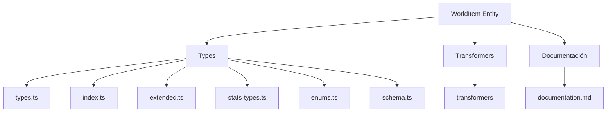
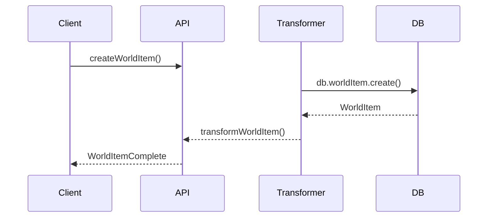

# 🌍 Entidad WorldItem

## Descripción

La entidad `WorldItem` representa objetos, artefactos, recursos o elementos del mundo que pueden asociarse a personajes, lugares, notas, imágenes y más. Permite modelar inventarios, recursos, artefactos mágicos, etc.

## Estructura



## Tipos principales

- `WorldItemBase`: Tipo base con campos fundamentales
- `WorldItemComplete`: Tipo completo con relaciones, conteos y campos deserializados
- `WorldItemCreateInput`, `WorldItemUpdateInput`: Inputs para mutaciones
- Filtros: `WorldItemFilters`, `WorldItemSearchOptions`
- Enumeraciones: `WorldItemType`, `WorldItemRarity`, `WorldItemCategory`

## Ejemplo de uso

```typescript
import { createWorldItem, updateWorldItem, searchWorldItems } from '@/transformers/world-item';

// Crear un nuevo objeto del mundo
const nuevoItem = await createWorldItem({
	name: 'Espada legendaria',
	type: 'weapon',
	rarity: 'legendary',
	description: 'Una espada forjada con metales antiguos',
	effects: [{ name: 'Llamas eternas', description: 'Causa daño por fuego adicional' }],
});

// Buscar objetos
const items = await searchWorldItems({
	filters: {
		query: 'Espada',
		rarities: ['legendary'],
	},
});

// Actualizar un objeto existente
await updateWorldItem(nuevoItem.id, {
	properties: [{ name: 'Durabilidad', value: 100 }],
});
```

## Flujo de datos



## Mejores prácticas

- Usar siempre los tipos canónicos (`WorldItemCreateInput`, `WorldItemUpdateInput`, `WorldItemComplete`).
- Validar los datos antes de crear/actualizar con ZodSchema.
- Usar los transformadores para manejar la serialización/deserialización de JSON.
- Mantener la documentación y diagramas actualizados.

## Integración

Los WorldItems pueden asociarse a:

- Personajes, lugares
- Imágenes, videos
- Notas, conceptos
- Prompts, tags
- Colecciones, álbumes
- Grupos, propiedades

## Migración a tipos canónicos

✅ Tipos canónicos migrados, legacy eliminado, documentación y diagrama actualizados.

---

> Última actualización: 2025-06-18
