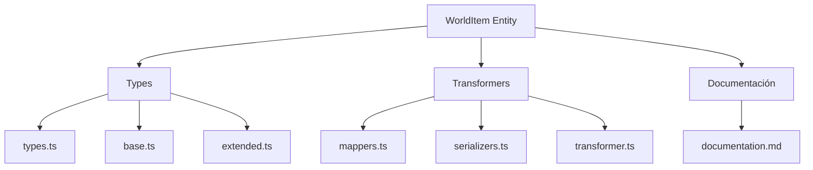
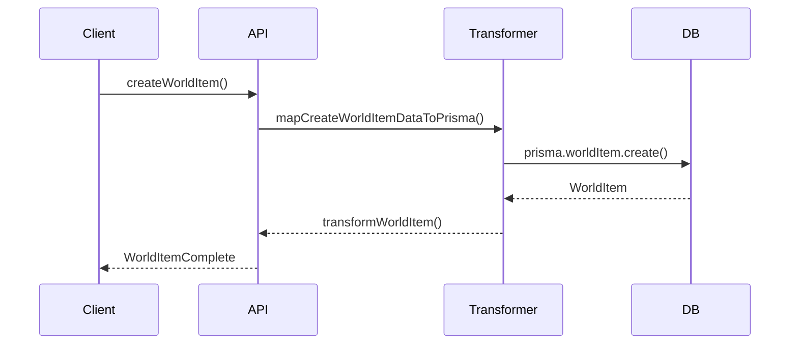

# 🌍 Entidad WorldItem

## Descripción

La entidad `WorldItem` representa objetos, artefactos, recursos o elementos del mundo que pueden asociarse a personajes, lugares, notas, imágenes y más. Permite modelar inventarios, recursos, artefactos mágicos, etc.

## Estructura



## Tipos principales

- `WorldItemBase`, `WorldItemComplete`, `WorldItemCreateInput`, `WorldItemUpdateInput`
- Filtros: `WorldItemFilters`, `WorldItemSearchOptions`, `WorldItemSearchResult`

### Campos principales

- **id**: identificador único del objeto
- **name**: nombre descriptivo
- **type**: categoría del objeto (`weapon`, `tool`, `artifact`, ...)
- **rarity**: rareza (`COMMON`, `RARE`, etc.)
- **stats**: objeto con estadísticas numéricas y efectos
- **properties**: lista de `WorldItemProperty`
- **createdAt** y **updatedAt**: timestamps de auditoría

## Ejemplo de uso

```typescript
import { createWorldItem, updateWorldItem, searchWorldItems } from '@/transformers/world-item';

const nuevoItem = await createWorldItem({ name: 'Espada legendaria', type: 'arma' });
const items = await searchWorldItems({ filters: { search: 'Espada' } });
await updateWorldItem(nuevoItem.id, { description: 'Una espada con poderes mágicos.' });
```

## Flujo de datos



## Mejores prácticas

- Usar siempre los tipos canónicos (`WorldItemCreateInput`, `WorldItemUpdateInput`, `WorldItemComplete`).
- Validar los datos antes de crear/actualizar (`validateWorldItem`).
- Usar los mapeadores para relaciones complejas.
- Mantener la documentación y diagramas actualizados.

## Integración

Los WorldItems pueden asociarse a:

- Personajes, lugares, notas, imágenes, álbumes, conceptos, prompts, grupos, etc.

Al eliminar un WorldItem, revisar las relaciones para evitar referencias huérfanas.

---

> Última actualización: 2025-06-11
